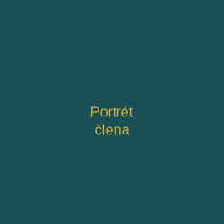

# Vitium - Divadelní soubor

Moderní, responzivní webové stránky divadelního souboru Vitium.

## � Spuštění

Jednoduše otevřete `index.html` v prohlížeči. Žádný server není potřeba.

## 📁 Struktura

```
vitium/
├── index.html              # Hlavní stránka
├── css/
│   ├── style.css          # Styly (696 řádků)
│   └── responsive.css     # Mobilní design
├── js/
│   └── main.js            # Interaktivita
├── images/
│   ├── logo.svg
│   ├── placeholder-portrait.svg
│   └── placeholder-production.svg
├── assets/                # Pro budoucí obsah
└── .gitignore
```

## 🎨 Barvy

- Primární: Petrolejová (#1a4f55)
- Sekundární: Zlatá (#d4af37)

## ✨ Sekce

1. **Hero** - Úvodní sekce s tagline
2. **O nás** - Informace + statistika
3. **Členové** - Galerie s 6 členy
4. **Repertoár** - 4 divadelní produkce
5. **Vystoupení** - Kalendář s filtrováním
6. **Kontakt** - Formulář + info
7. **Footer** - Navigace

## 📱 Responsive

- Desktop: 1200px+
- Tablet: 768-1024px
- Mobilní: 481-767px
- Malý mobilní: 320-480px

## 💻 Technologie

- HTML5
- CSS3 (Grid, Flexbox)
- JavaScript (Vanilla)
- SVG

## 🔧 Přizpůsobení

**Změna textu:** Editujte `index.html`

**Přidání člena:**
```html
<div class="member-card">
    <div class="member-image">
        
    </div>
    <h3 class="member-name">Jméno</h3>
    <p class="member-role">Role</p>
    <p class="member-bio">Biografie</p>
</div>
```

**Nové představení:**
```html
<div class="performance-item" data-date="2026-04-DD">
    <div class="performance-date">
        <span class="date-day">DD</span>
        <span class="date-month">Měsíc</span>
    </div>
    <div class="performance-details">
        <h3 class="performance-title">Název</h3>
        <p class="performance-venue">Divadlo</p>
        <p class="performance-time">Čas</p>
    </div>
    <div class="performance-action">
        <a href="#" class="ticket-btn">Vstupenky</a>
    </div>
</div>
```

**Změna barev:** Upravte proměnné v `css/style.css`:
```css
:root {
    --color-primary: #1a4f55;
    --color-secondary: #d4af37;
    ...
}
```

## 📸 Nahrazení obrázků

Umístěte vaše obrázky do `images/` a změňte v HTML:
```html

```

## 🌐 Publikace

### Netlify (ZDARMA)
1. Push na GitHub
2. Připojte repo na netlify.com
3. Deploy!

### GitHub Pages
1. Push na GitHub
2. Settings → Pages → Deploy from main
3. Dostupné na `username.github.io/vitium`

### Tradiční hosting
1. Upload na FTP
2. Nahrajte do `public_html`
3. Namapujte doménu

## 📝 Obsah

"Vitium" znamená v latině "vada" - symbol autentičnosti a hloubky. Soubor se zaměřuje na experimentální divadelní formy.

## 📞 Kontakt

Email: info@vitium.cz
Telefon: +420 777 123 456
Adresa: Divadelní 42, Praha 1
